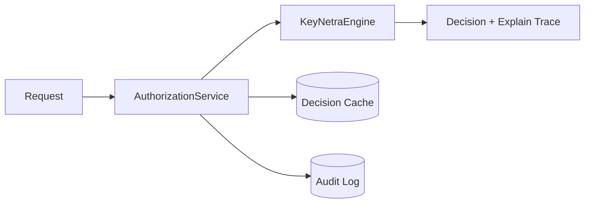

<div align="center">
  

  

  <p>
    <a href="./.github/workflows/ci.yml"></a>
    <a href="./pyproject.toml"></a>
    <a href="./LICENSE"></a>
    <a href="./contracts/openapi/keynetra-v0.1.0.yaml"></a>
    <a href="./docs/README.md"></a>
  </p>

  
</div>

<p align="center">
  <strong>Policy-driven authorization and access control engine for modern applications.</strong>
</p>

KeyNetra is an open-source authorization core built for teams that need Stripe/Keycloak/Casbin-level operational clarity while keeping architecture and deployment under their control.

## Why KeyNetra

- Deterministic evaluation pipeline with explain traces.
- Multiple authorization models in one runtime:
  - RBAC
  - ACL
  - ReBAC
  - schema-permission checks
  - compiled policy graph evaluation
- Headless-first operation:
  - HTTP API
  - CLI
  - embedded Python engine
- Production-focused defaults:
  - migrations
  - cache layers
  - observability metrics
  - Docker/Kubernetes deployment assets

## Table Of Contents

- [Quick Start](#quick-start)
- [Core Capabilities](#core-capabilities)
- [Usage Modes](#usage-modes)
- [Architecture](#architecture)
- [API Surface](#api-surface)
- [Configuration](#configuration)
- [Security](#security)
- [Caching and Consistency](#caching-and-consistency)
- [Observability](#observability)
- [Deployment](#deployment)
- [Development](#development)
- [Documentation](#documentation)
- [Release and Compatibility](#release-and-compatibility)
- [Citation](#citation)
- [Contributing](#contributing)
- [License](#license)

## Quick Start

### 1) Install

```bash
python3.11 -m venv .venv
source .venv/bin/activate
pip install -r requirements.txt -r requirements-dev.txt
cp .env.example .env
```

### 2) Start API

```bash
python -m keynetra.cli serve --config examples/keynetra.yaml
```

### 3) Verify health

```bash
curl -i http://localhost:8000/health/ready
```

### 4) Run first authorization check

```bash
curl -s -X POST http://localhost:8000/check-access \
  -H "Content-Type: application/json" \
  -H "X-API-Key: devkey" \
  -d '{
    "user": {"id": 1, "role": "manager"},
    "action": "approve_payment",
    "resource": {"amount": 5000},
    "context": {}
  }'
```

## Core Capabilities

| Capability | Details |
| --- | --- |
| RBAC | Roles, permissions, role-permission bindings |
| ACL | Subject/resource/action-level allow/deny |
| ReBAC | Relationship tuples and index-assisted checks |
| Compiled policy graph | Deterministic policy evaluation stage |
| Auth modeling | Schema parser + validator + compiler |
| Simulation | `/simulate-policy` and `/impact-analysis` |
| Cache layers | Policy, decision, relationship, ACL, access index |
| Observability | Prometheus metrics + structured logs |
| Runtime modes | API, CLI, embedded Python |

## Usage Modes

### API Server Mode

```bash
python -m keynetra.cli serve --config examples/keynetra.yaml
```

### CLI Mode

```bash
python -m keynetra.cli help-cli
python -m keynetra.cli check --config examples/keynetra.yaml --api-key devkey --action read --user '{"id":"u1"}' --resource '{"resource_type":"document","resource_id":"doc-1"}'
python -m keynetra.cli compile-policies --config examples/keynetra.yaml
python -m keynetra.cli doctor --service core --config examples/keynetra.yaml
```

### Embedded Python Mode

```python
from keynetra import KeyNetra

engine = KeyNetra.from_config("examples/keynetra.yaml")
engine.load_policies("examples/policies")
engine.load_model("examples/auth-model.yaml")

decision = engine.check_access(
    subject="user:1",
    action="read",
    resource="document:abc",
    context={},
)
print(decision.allowed)
```

### Pure Engine Import

```python
from keynetra.engine import KeyNetraEngine

engine = KeyNetraEngine(
    [{"action": "read", "effect": "allow", "priority": 1, "conditions": {}}]
)
decision = engine.check_access(
    subject="user:123",
    action="read",
    resource="document:abc",
    context={},
)
print(decision.allowed)
```

## Architecture

Layered boundaries:

- `keynetra/engine`: deterministic decision logic only
- `keynetra/services`: orchestration, hydration, consistency handling
- `keynetra/infrastructure`: DB/cache/repository side effects
- `keynetra/api`: transport, middleware, and route wiring



Engine evaluation order:

1. direct user permissions
2. ACL checks
3. RBAC role permissions
4. relationship index checks
5. schema permission checks
6. compiled policy graph checks
7. default deny

## API Surface

OpenAPI contract: [`contracts/openapi/keynetra-v0.1.0.yaml`](./contracts/openapi/keynetra-v0.1.0.yaml)

Key endpoints:

- Decisions:
  - `POST /check-access`
  - `POST /check-access-batch`
  - `POST /simulate`
- Modeling:
  - `POST /auth-model`
  - `GET /auth-model`
- ACL:
  - `POST /acl`
  - `GET /acl/{resource_type}/{resource_id}`
  - `DELETE /acl/{acl_id}`
- Simulation:
  - `POST /simulate-policy`
  - `POST /impact-analysis`
- Health and metrics:
  - `GET /health`
  - `GET /health/live`
  - `GET /health/ready`
  - `GET /metrics`
- Admin auth:
  - `POST /admin/login`

## Configuration

KeyNetra supports YAML, JSON, and TOML config files:

```bash
python -m keynetra.cli serve --config examples/keynetra.yaml
```

Example (`examples/keynetra.yaml`):

```yaml
database:
  url: sqlite+pysqlite:///./keynetra.db

redis:
  url: redis://localhost:6379/0

policies:
  path: ./examples/policies

models:
  path: ./examples/auth-model.yaml

seed_data: true

server:
  host: 0.0.0.0
  port: 8080
```

Policy/model file support:

- policies: `.yaml`, `.json`, `.polar`
- auth models: `.yaml`, `.json`, `.toml` (plus raw schema/text)

## Security

- API key auth (`X-API-Key`)
- JWT bearer auth
- admin login endpoint (`/admin/login`)
- management role enforcement (`viewer`, `developer`, `admin`)
- idempotency middleware for write safety
- API version negotiation (`X-API-Version`)

For disclosure policy, see [`SECURITY.md`](./SECURITY.md).

## Caching and Consistency

Cache layers:

- policy cache
- decision cache
- relationship cache
- ACL cache
- access-index cache

Distribution and invalidation:

- Redis backend with in-memory fallback
- namespace bump invalidation strategy
- policy distribution via Redis Pub/Sub

## Observability

- Prometheus metrics at `GET /metrics`
- structured logging (JSON) and rich colored logs
- explain traces and audit records for decision transparency

Docker monitoring stack includes:

- Prometheus: `http://localhost:9090`
- Grafana: `http://localhost:3000`

## Deployment

### Docker Compose (default)

```bash
docker compose up --build
```

### Docker Compose (development)

```bash
docker compose -f docker-compose.dev.yml up --build
```

Services included in stack:

- KeyNetra API
- PostgreSQL
- Redis
- Prometheus
- Grafana

Kubernetes baseline:

- Helm chart at `infra/k8s/helm/keynetra`

## Development

```bash
make install
make lint
make test
make migrate
make run
```

Policy and diagnostics:

```bash
python -m keynetra.cli test-policy examples/policy_tests.yaml
python -m keynetra.cli explain --user u1 --resource r1 --action read
python -m keynetra.cli benchmark --api-key devkey
```

## Documentation

- docs index: [`docs/README.md`](./docs/README.md)
- architecture notes: [`architecture.md`](./architecture.md)
- Docusaurus site app: [`docs-site/`](./docs-site/)
- sidebar config: [`docs-site/sidebars.ts`](./docs-site/sidebars.ts)
- Docusaurus config: [`docs-site/docusaurus.config.ts`](./docs-site/docusaurus.config.ts)

## Release and Compatibility

Current version: `0.1.0`

- package version: [`pyproject.toml`](./pyproject.toml)
- runtime version: [`keynetra/version.py`](./keynetra/version.py)
- release notes: [`CHANGELOG.md`](./CHANGELOG.md)

Compatibility:

- Python `3.11+`
- DB: PostgreSQL, SQLite
- Cache: Redis optional
- Deployment: Docker Compose, Helm baseline

## Citation

```bibtex
@software{keynetra_v0_1_0,
  title   = {KeyNetra: Policy-driven Authorization and Access Control Engine},
  author  = {KeyNetra Community},
  year    = {2026},
  version = {0.1.0},
  url     = {https://github.com/keynetra/keynetra-core}
}
```

## Contributing

Contributions are welcome.

- contribution guide: [`CONTRIBUTING.md`](./CONTRIBUTING.md)
- security policy: [`SECURITY.md`](./SECURITY.md)

## License

Apache License 2.0. See [`LICENSE`](./LICENSE).

---

<p align="center">
  Made with <b>love</b> for the <b>KeyNetra Community</b>.
</p>
