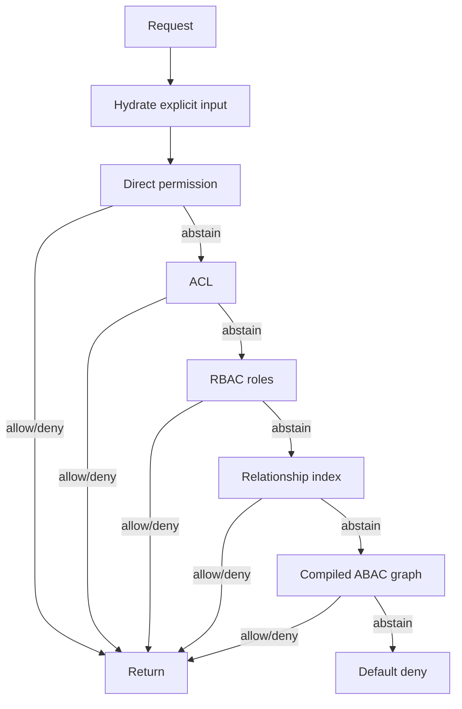

# KeyNetra Core Architecture

## Boundaries

- `keynetra.engine` is pure and deterministic.
  It accepts a single `AuthorizationInput` object and returns an `AuthorizationDecision`.
  It imports only the Python standard library and has no access to DB sessions, caches, HTTP objects, or external state.
- `keynetra.services` orchestrates workflows.
  Services validate inputs, hydrate explicit engine inputs from repositories, invoke the engine, coordinate cache lookups, and write audit records.
- `keynetra.infrastructure` owns side effects.
  Repositories handle SQLAlchemy access. Cache adapters handle Redis or in-memory fallback. Policy event publishing also lives here.
- `keynetra.api` is transport only.
  Routes translate HTTP requests into service calls and map service outputs back to response models.

## Authorization Flow

1. API receives `user`, `resource`, `action`, and optional `context`.
2. `AuthorizationService` loads the tenant, current policies, user context, and relationships through repository/cache interfaces.
3. The service builds one explicit `AuthorizationInput` and hydrates ACL and access-index data when available.
4. `KeyNetraEngine` evaluates that input deterministically in this order:
   - direct user permissions
   - ACL entries
   - RBAC role permissions
   - relationship index checks
   - compiled ABAC policy graph
   - default deny
5. The engine returns:
   - `decision`
   - `reason`
   - `policy_id`
   - `explain_trace`
6. The service stores the decision in the short-TTL decision cache and writes the audit log through infrastructure.
7. API returns the decision without embedding business logic.

## Cache Layers

- Decision cache:
  Uses a stable hash of the full hydrated authorization input plus tenant policy version.
  A tenant namespace counter invalidates cached decisions after policy or relationship changes.
- Policy cache:
  Stores serialized current policy definitions by tenant and policy version.
  Policy updates bump a policy namespace and publish an invalidation event.
- Relationship cache:
  Stores relationship edges per tenant subject.
  Relationship writes invalidate that subject cache entry and bump the tenant decision namespace.
- ACL cache:
  Stores resource-level ACL rows by tenant/resource/action.
  ACL writes invalidate the resource namespace so ACL and access-index lookups refresh together.
- Access index cache:
  Stores resource/action subject indexes for ACL and relationship matches.
  Relationship, ACL, and role-binding updates invalidate the relevant resource namespace.
- Compiled policy graph cache:
  Keeps an in-memory executable graph per tenant policy version.
  Policy updates rebuild the graph from the existing DSL and store the compiled nodes in memory.

## Determinism Rules

- No randomness is used in the engine.
- No hidden state is read by the engine.
- Time-based rules require explicit `context.current_time`.
- Relationship checks depend only on explicit relationship edges supplied in `AuthorizationInput.user["relations"]`.
