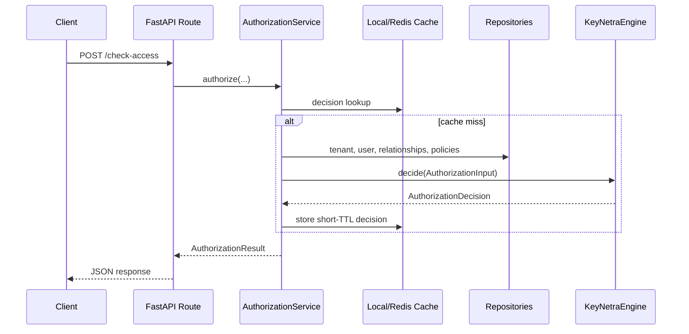

# Architecture

KeyNetra enforces clean layering so policy decisions remain deterministic and easy to audit.

## Layers

- `keynetra.api`: HTTP transport, request/response models, middleware
- `keynetra.services`: orchestration, validation, hydration, cache coordination
- `keynetra.engine`: pure authorization engine
- `keynetra.infrastructure`: storage, repository, cache, logging, metrics adapters
- `keynetra.domain`: shared models and schemas
- `keynetra.config`: settings, file loading, security guardrails

## Request Flow

## Evaluation Order

The engine evaluates authorization in a deterministic sequence:

1. Direct user permissions
2. ACL entries
3. Role-based permissions
4. Relationship access index
5. Authorization model / compiled policy graph
6. Default deny

## Why This Matters

- Deterministic order makes explanations stable.
- The engine is side-effect free.
- Caches are outside the engine, so a decision can always be recomputed from explicit input.

## Further Reading

- [Authorization Models](authorization-models.md)
- [Policy Engine](policy-engine.md)
- [Caching](operations/caching.md)
