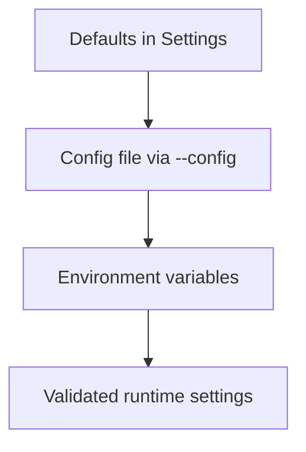

# Configuration

KeyNetra uses `KEYNETRA_`-prefixed environment variables and also accepts YAML/JSON/TOML config files through `--config`.

## Core Variables

| Variable | Purpose | Default |
| --- | --- | --- |
| `KEYNETRA_ENVIRONMENT` | Runtime mode: `development`, `dev`, `local`, `ci`, `prod` | `development` |
| `KEYNETRA_DATABASE_URL` | SQLAlchemy database URL | `sqlite+pysqlite:///./keynetra.db` |
| `KEYNETRA_REDIS_URL` | Optional Redis URL for distributed caching and invalidation | unset |
| `KEYNETRA_API_KEYS` | Comma-separated development API keys | unset |
| `KEYNETRA_API_KEY_HASHES` | SHA-256 API key hashes for production | unset |
| `KEYNETRA_API_KEY_SCOPES_JSON` | Key-to-scope mapping JSON | unset |
| `KEYNETRA_JWT_SECRET` | JWT signing secret | `change-me` in dev only |
| `KEYNETRA_JWT_ALGORITHM` | JWT signing algorithm | `HS256` |
| `KEYNETRA_STRICT_TENANCY` | Require explicit tenant resolution | `false` |
| `KEYNETRA_DECISION_CACHE_TTL_SECONDS` | Decision cache TTL in seconds | `5` |
| `KEYNETRA_SERVICE_TIMEOUT_SECONDS` | Backend operation timeout | `2.0` |
| `KEYNETRA_RATE_LIMIT_DISABLED` | Disable rate limiting | `false` |
| `KEYNETRA_SERVER_HOST` | Bind host for `serve` | `0.0.0.0` |
| `KEYNETRA_SERVER_PORT` | Bind port for `serve` | `8000` |

## Config File Usage

```bash
keynetra serve --config examples/keynetra.yaml
keynetra compile-policies --config examples/keynetra.yaml
```

## Example YAML

```yaml
environment: development
database_url: sqlite+pysqlite:///./keynetra.db
api_keys: devkey
api_key_scopes_json: |
  {"devkey":{"tenant":"default","role":"admin","permissions":["*"]}}
policy_paths: examples/policies
model_paths: examples/auth-model.yaml
strict_tenancy: false
decision_cache_ttl_seconds: 5
```

## Security Guardrails

- Production rejects SQLite by default.
- Production requires at least one real auth method.
- `KEYNETRA_JWT_SECRET=change-me` is rejected outside development.
- Blank `KEYNETRA_REDIS_URL` values are rejected.

## Configuration Resolution



## Related Docs

- [Architecture](architecture.md)
- [Operations / Security](operations/security.md)
- [Troubleshooting](troubleshooting.md)
