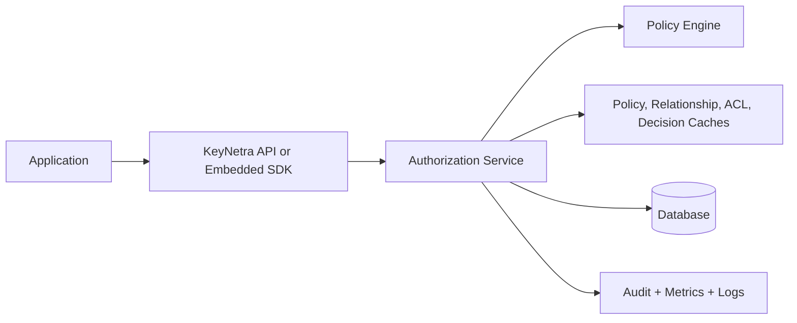

# KeyNetra Documentation

KeyNetra is an authorization control plane for applications that need deterministic, explainable access decisions across RBAC, ABAC, ACL, and relationship-based access control.

## What You Get

- REST API for synchronous authorization checks
- Operational CLI for validation, simulation, migration, and benchmarking
- OpenAPI contract generation
- Docker, Kubernetes, and Helm deployment assets
- Short-TTL decision caching with optional Redis-backed distribution
- Structured logs, metrics, and audit trails

## Documentation Map

- [Quickstart](quickstart.md)
- [Installation](installation.md)
- [Configuration](configuration.md)
- [Architecture](architecture.md)
- [Authorization Models](authorization-models.md)
- [Policy Engine](policy-engine.md)
- [API Reference](api-reference.md)
- [CLI Reference](cli-reference.md)
- [SDK Guide](sdk-guide.md)
- [Docker Deployment](deployment/docker.md)
- [Kubernetes Deployment](deployment/kubernetes.md)
- [Helm Deployment](deployment/helm.md)
- [Caching](operations/caching.md)
- [Scaling](operations/scaling.md)
- [Observability](operations/observability.md)
- [Security](operations/security.md)
- [Contributing](contributing.md)
- [Troubleshooting](troubleshooting.md)

## System Overview

## Recommended Reading Order

1. Start with [Quickstart](quickstart.md).
2. Review [Authorization Models](authorization-models.md) and [Policy Engine](policy-engine.md).
3. Choose a deployment path from the `deployment/` section.
4. Use the `operations/` documents for production hardening and runtime support.
